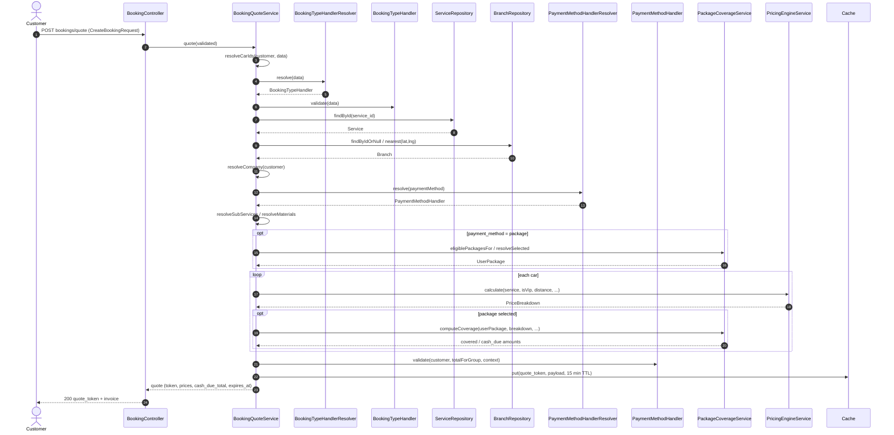

# Booking / Payment — Sequence Diagram

Traced from the actual code. The create-and-pay path is a **two-step flow**:
`POST bookings/quote` (validate + price + cache a token) then
`POST bookings/confirm` (redeem the token, create the order(s), settle payment).

Source files:
- `app/Http/Controllers/Operations/BookingController.php` — `quote()`, `confirm()`
- `app/Services/Operations/BookingQuoteService.php` — `quote()`, `confirm()`
- `app/Services/Operations/Booking/BookingTypeHandlerResolver.php`
- `app/Services/Operations/Payment/PaymentMethodHandlerResolver.php`
- `app/Services/Operations/Payment/WalletPaymentHandler.php` (representative handler)
- `app/Repositories/Eloquent/OrderRepository.php`
- `app/Observers/PaymentObserver.php`

---

## Phase 1 — Quote (`POST bookings/quote`)



---

## Phase 2 — Confirm & Settle (`POST bookings/confirm`)

```mermaid
sequenceDiagram
    autonumber
    actor Customer
    participant Ctrl as BookingController
    participant QS as BookingQuoteService
    participant Cache as Cache
    participant PMR as PaymentMethodHandlerResolver
    participant PH as PaymentMethodHandler
    participant OR as OrderRepository
    participant Order as Order (model)
    participant BTH as BookingTypeHandler
    participant WR as WalletRepository
    participant Pay as Payment (model)
    participant Obs as PaymentObserver
    participant PR as PointRepository
    participant IR as InventoryRepository
    participant Audit as AuditLog

    Customer->>Ctrl: POST bookings/confirm (quote_token)
    Ctrl->>QS: confirm(quote_token)
    QS->>Cache: pull(quote_token)
    Cache-->>QS: payload (or invalid → ValidationException)
    QS->>PMR: resolve(payment_method)
    PMR-->>QS: PaymentMethodHandler

    rect rgb(235,242,250)
    note over QS,Audit: DB::transaction — one order per car
    loop each car_id
        QS->>OR: create(OrderDTO)
        OR->>Order: Order::create(...)
        OR-->>QS: Order
        QS->>Order: priceItems / subServices / materials createMany
        QS->>BTH: afterCreate(order, data)
        QS->>PH: settle(order, amount, context)

        note over PH,WR: WalletPaymentHandler shown; Cash/Points/Package settle their own way
        PH->>WR: debit(customer, ORDER_PAYMENT, amount)
        PH->>Pay: Payment::create(status = PAID)

        Pay-->>Obs: created(payment)
        Obs->>PR: awardPoints → createTransaction(EARN)
        Obs->>IR: deductMaterials → inventory OUT
        Obs->>Audit: AuditLog::create(action = created)
    end
    end

    QS->>Customer: notify BookingConfirmedNotification
    QS->>QS: notify branch admin (BookingPlacedAdminNotification)
    QS-->>Ctrl: Order[]
    Ctrl-->>Customer: 200 Booking confirmed
```

---

### Notes on fidelity to the code
- The payment is settled **inside** `confirm()` (in the `DB::transaction`), not via a separate payment endpoint. `PaymentController::confirmCash` is a *later* action (cash collection), not part of this create flow.
- `WalletPaymentHandler` is drawn as the representative handler. `Cash`, `Points`, and `Package` handlers implement the same `settle()` interface with different side effects.
- `awardPoints`, `deductMaterials`, and `audit` all run from `PaymentObserver::created()` the moment a `Payment` row with `status = PAID` and `type = ORDER` is inserted.
- Package bookings can produce a `cash_due_amount` (partial cash portion) — this is coverage splitting, **not** a 50% deposit feature.
```
